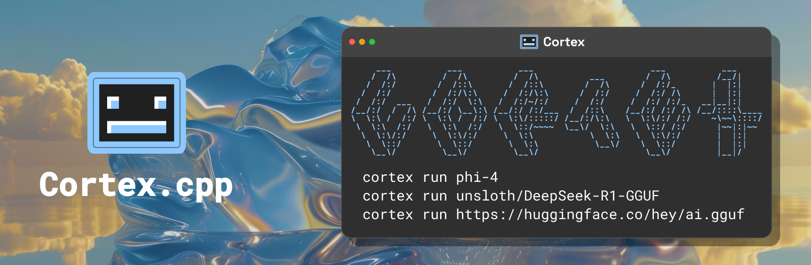

# Cortex

<p align="center">
  
</p>

<p align="center">
  
  
  
  
</p>

<p align="center">
  <a href="https://cortex.so/docs/">Docs</a> •
  <a href="https://cortex.so/api-reference">API Reference</a> •
  <a href="https://github.com/janhq/cortex.cpp/releases">Changelog</a> •
  <a href="https://github.com/janhq/cortex.cpp/issues">Issues</a> •
  <a href="https://discord.gg/AsJ8krTT3N">Community</a>
</p>

> **Under Active Development** - Expect rapid improvements!


Cortex is the open-source brain for robots: vision, speech, language, tabular, and action -- the cloud is optional.

## Installation

| Platform | Installer |
|----------|-----------|
| **Windows** | [cortex.exe](https://app.cortexcpp.com/download/latest/windows-amd64-local) |
| **macOS** | [cortex.pkg](https://app.cortexcpp.com/download/latest/mac-universal-local) |
| **Linux (Debian)** | [cortex.deb](https://app.cortexcpp.com/download/latest/linux-amd64-local) |


All other Linux distributions:
```bash
curl -s https://raw.githubusercontent.com/janhq/cortex/main/engine/templates/linux/install.sh | sudo bash
```

### Start the Server

```bash
cortex start
```
```
Set log level to INFO
Host: 127.0.0.1 Port: 39281
Server started
API Documentation available at: http://127.0.0.1:39281
```

[Full API docs](https://cortex.so/api-reference).

### Download Models

You can download models from the huggingface model hub using the `cortex pull` command:

```bash
cortex pull llama3.2
```
```
Downloaded models:
    llama3.1:8b-gguf-q4-km
    llama3.2:3b-gguf-q2-k

Available to download:
    1. llama3:8b-gguf
    2. llama3:8b-gguf-q2-k
    3. llama3:8b-gguf-q3-kl
    4. ...

Select a model (1-21):
```

### Run Models

```sh
cortex run llama3.2
```
```
In order to exit, type `exit()`
>
```

You can also run it in detached mode, meaning, you can run it in the background and can
use the model via the API:

```sh
cortex run -d llama3.2:3b-gguf-q2-k
```

### Manage resources

```sh
cortex ps            # View active models
```

```sh
cortex stop          # Shutdown server
```

## Why Cortex.cpp?

Local AI platform for running AI models with:

- **Multi-Engine Support** - Start with llama.cpp or add your own
- **Hardware Optimized** - Automatic GPU detection (NVIDIA/AMD/Intel)
- **OpenAI-Compatible API** - Tools, Runs, and Multi-modal coming soon

## Featured Models

| Model          | Command                   | Min RAM |
|----------------|---------------------------|---------|
| Llama 3 8B     | `cortex run llama3.1`     | 8GB     |
| Phi-4          | `cortex run phi-4`       | 8GB     |
| Mistral        | `cortex run mistral`      | 4GB     |
| Gemma 2B       | `cortex run gemma2`       | 6GB     |

[View all supported models →](https://cortex.so/models)

## Advanced Features

See table below for the binaries with the nightly builds.

```bash
# Multiple quantizations
cortex-nightly pull llama3.2  # Choose from several quantization options
```

```bash
# Engine management (nightly)
cortex-nightly engines install llama-cpp -m
```

```sh
# Hardware control
cortex-nightly hardware detect
cortex-nightly hardware activate
```

## Need Help?

- Quick troubleshooting: `cortex --help`
- [Documentation](https://cortex.so/docs)
- [Community Discord](https://discord.gg/FTk2MvZwJH)
- [Report Issues](https://github.com/janhq/cortex.cpp/issues)

---

## For Contributors

### Development Builds

| Version   | Windows | macOS | Linux |
|-----------|---------|-------|-------|
| **Stable** | [exe](https://app.cortexcpp.com/download/latest/windows-amd64-network) | [pkg](https://app.cortexcpp.com/download/latest/mac-universal-network) | [deb](https://app.cortexcpp.com/download/latest/linux-amd64-network) |
| **Beta** | [exe](https://app.cortexcpp.com/download/beta/windows-amd64-network) | [pkg](https://app.cortexcpp.com/download/beta/mac-universal-network) | [deb](https://app.cortexcpp.com/download/beta/linux-amd64-network) |
| **Nightly** | [exe](https://app.cortexcpp.com/download/nightly/windows-amd64-network) | [pkg](https://app.cortexcpp.com/download/nightly/mac-universal-network) | [deb](https://app.cortexcpp.com/download/nightly/linux-amd64-network) |

### Build from Source

See [BUILDING.md](BUILDING.md)

## Uninstall Cortex

### Windows

1. Open the Windows Control Panel.
2. Navigate to `Add or Remove Programs`.
3. Search for `cortexcpp` and double click to uninstall. (for beta and nightly builds, search for `cortexcpp-beta` and `cortexcpp-nightly` respectively)

### MacOs/Linux

Run the uninstaller script:

```bash
sudo cortex-uninstall.sh
```

The script to uninstall Cortex comes with the binary and was added to the `/usr/local/bin/` directory. The script is named `cortex-uninstall.sh` for stable builds, `cortex-beta-uninstall.sh` for beta builds and `cortex-nightly-uninstall.sh` for nightly builds.

## Contact Support

- For support, please file a [GitHub ticket](https://github.com/janhq/cortex.cpp/issues/new/choose).
- For questions, join our Discord [here](https://discord.gg/FTk2MvZwJH).
- For long-form inquiries, please email [hello@jan.ai](mailto:hello@jan.ai).