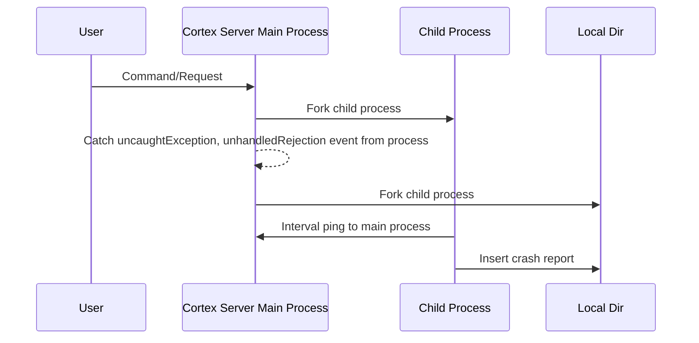

import Tabs from '@theme/Tabs';
import TabItem from '@theme/TabItem';

:::warning
🚧 Cortex.cpp is currently under development. Our documentation outlines the intended behavior of Cortex, which may not yet be fully implemented in the codebase.
:::

## Architecture
import Diagram from "../src/components/Diagram"

<Diagram diagramPath={"/diagrams/Telemetry.excalidraw"} />
The telemetry capability comprises several key components:
1. **Telemetry Collector**: This component gathers telemetry data from the Cortex and exports it to other observability tools for further analysis and monitoring.
2. **Jan Telemetry Server**: This component ingests telemetry data from Cortex. It processes this data and forwards events to Google Logging for further handling.
3. **Google Logging**: This component receives events from the Jan Telemetry Server. It stores and manages these logs and exports them to BigQuery.
4. **Google BigQuery**: This component stores the exported logs from Google Logging. 
5. **Metabase**: This component connects to Google BigQuery to perform queries and visualize the data. It provides an interface for analyzing and presenting the telemetry data.

### Crash Report Schema
```json
{
  "$schema": "http://json-schema.org/draft-07/schema#",
  "definitions": {
    "StringValue": {
      "type": "object",
      "properties": {
        "stringValue": {
          "type": "string"
        }
      },
      "required": ["stringValue"]
    },
    "ObjectValue": {
      "type": "object",
      "properties": {
        "kvlist_value": {
          "type": "object",
          "properties": {
            "values": {
              "type": "array",
              "items": {
                "type": "object",
                "properties": {
                  "key": {
                    "type": "string"
                  },
                  "value": {
                    "$ref": "#/definitions/StringValue"
                  }
                },
                "required": ["key", "value"]
              }
            }
          },
          "required": ["values"]
        }
      },
      "required": ["kvlist_value"]
    },
    "Attribute": {
      "type": "object",
      "properties": {
        "key": {
          "type": "string"
        },
        "value": {
          "oneOf": [
            { "$ref": "#/definitions/StringValue" },
            { "$ref": "#/definitions/ObjectValue" }
          ]
        }
      },
      "required": ["key", "value"]
    },
    "TelemetryLog": {
      "type": "object",
      "properties": {
        "traceId": {
          "type": "string"
        },
        "startTimeUnixNano": {
          "type": "string"
        },
        "endTimeUnixNano": {
          "type": "string"
        },
        "severityText": {
          "type": "string"
        },
        "body": {
          "type": "object",
          "properties": {
            "stringValue": {
              "type": "string"
            }
          },
          "required": ["stringValue"]
        },
        "attributes": {
          "type": "array",
          "items": { "$ref": "#/definitions/Attribute" }
        }
      },
      "required": ["traceId", "severityText", "body", "attributes"]
    },
    "ScopeLog": {
      "type": "object",
      "properties": {
        "scope": {
          "type": "object"
        },
        "logRecords": {
          "type": "array",
          "items": { "$ref": "#/definitions/TelemetryLog" }
        }
      },
      "required": ["scope", "logRecords"]
    },
    "Resource": {
      "type": "object",
      "properties": {
        "attributes": {
          "type": "array",
          "items": { "$ref": "#/definitions/Attribute" }
        }
      },
      "required": ["attributes"]
    },
    "TelemetryEvent": {
      "type": "object",
      "properties": {
        "resource": { "$ref": "#/definitions/Resource" },
        "scopeLogs": {
          "type": "array",
          "items": { "$ref": "#/definitions/ScopeLog" }
        }
      },
      "required": ["resource", "scopeLogs"]
    }
  },
  "type": "object",
  "properties": {
    "resourceLogs": {
      "type": "array",
      "items": { "$ref": "#/definitions/TelemetryEvent" }
    }
  },
  "required": ["resourceLogs"]
}
```
## Implementation


The diagram illustrates the implementation of handling crashes in the Cortex server environment:

1. **User Interaction**
    - The user sends a command or requests to the Cortex Server Main Process.
2. **Cortex Server Main Process**
    - The main process handles the initial command or request.
    - It forks a child process to monitor and handle errors.
    - To manage unexpected errors, the main process catches any `uncaughtException` or `unhandledRejection` events.
3. **Child Process**
    - A child process is forked to perform periodic checks (interval pings) to ensure the main process is not hanging or unresponsive.
    - This child process can also capture and log errors.
4. **Local Directory**
    - If a crash is detected, the error details and crash reports are inserted into a local directory for further analysis and record-keeping.


:::info
Learn more about Telemetry:
- [Telemetry CLI command](/docs/cli/telemetry).
:::