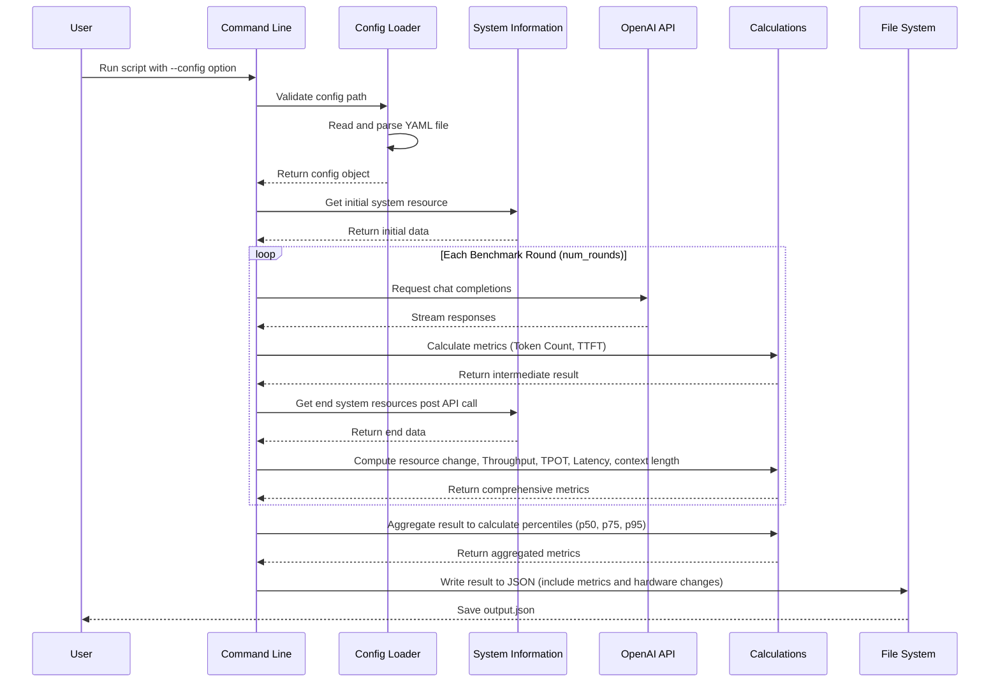

:::warning
🚧 Cortex.cpp is currently under development. Our documentation outlines the intended behavior of Cortex, which may not yet be fully implemented in the codebase.
:::

## Architecture

import Diagram from "../src/components/Diagram"

<Diagram diagramPath={"/diagrams/benchmarking.excalidraw"} />

The benchmarking capability comprises several key components:
1. **User Devices**:
   - **Workstation, Desktop, Server**: These devices collect and send benchmarking data directly to the Supabase Backend in the Jan Cloud.
   - **Web Interface**: Users interact with the system through the web interface which is the Cortex's CLI, which also sends data to the Supabase Backend.

2. **Supabase Backend**: This component acts as the central hub for collecting and processing data from all user devices.

3. **Data Storage**:
   - **Postgres**: Stores structured data and relational information related to benchmarking results and user interactions.
   - **S3**: Stores large files, logs, and other unstructured data necessary.

4. **Post-processing**: Data stored in Postgres and S3 is utilized for various benchmarking analyzes.

5. **Web Interface**: The processed data and benchmarking results are made available to users through the web interface which is the Cortex's CLI. Users can view, and convert the benchmarking reports to `JSON` from this interface.

## Implementation

The diagram illustrates the implementation of how the benchmarking works in the Cortex environment:
1. **User**:
   - The user runs the benchmarking command with a `--config` option.
2. **Command Line**:
   - The command line validates the config path provided by the user.
   - It then reads and parses the YAML file to load the configuration.
3. **Config Loader**:
   - Returns a config object back to the command line.
   - The command line then requests the initial system resources from the System Information module.
4. **System Information**:
   - Returns the initial data to the command line.
5. **Benchmarking Loop**:
   - The loop begins and iterates for each benchmark round (specified by `num_rounds`).
6. **OpenAI API**:
   - Within each round, the system requests chat completions from the OpenAI API.
   - The API streams responses back.
7. **Calculations**:
   - The system calculates various metrics from the responses such as Token Count and Time to First Token (TTFT).
   - Intermediate results are returned.
8. **System Information**:
   - After the API call, the system collects end system resources.
9. **Calculations**:
   - Computes resource changes, including Throughput, Total Processing Time (TPOT), Latency, and context length.
   - Returns comprehensive metrics.
   - Aggregates results to calculate percentiles (p50, p75, p95).
10. **File System**:
    - Writes the results, including metrics and hardware changes, to a JSON file.
    - Saves the output as `output.json`.

:::info
Learn more about Benchmarking:
- [Benchmarking CLI command](/docs/cli/benchmark)
:::