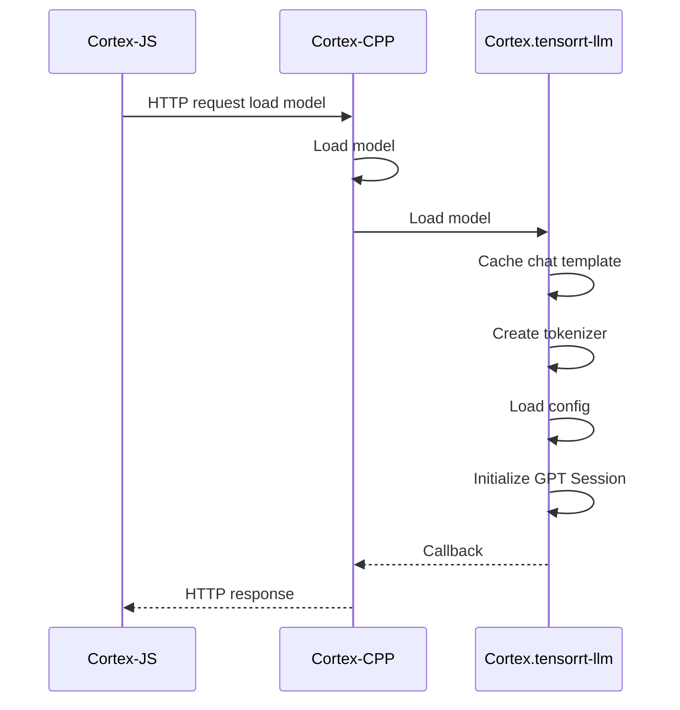
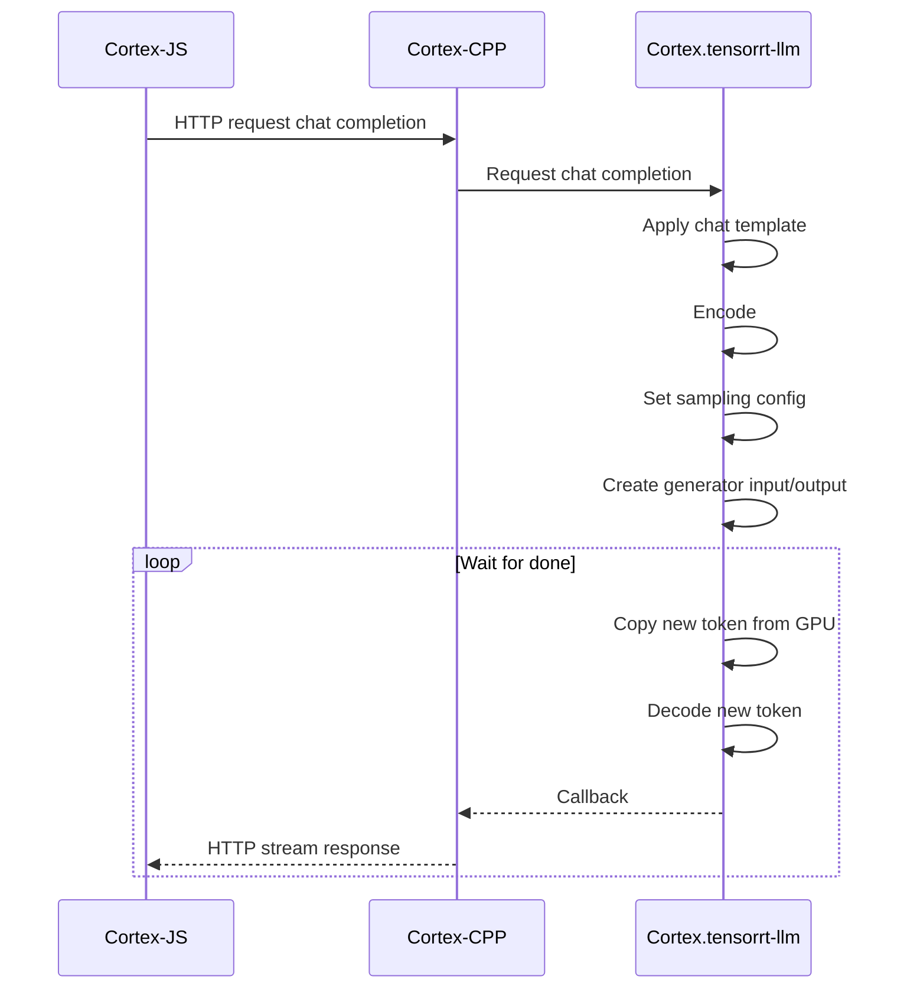

import Tabs from "@theme/Tabs";
import TabItem from "@theme/TabItem";

:::warning
🚧 Cortex.cpp is currently under development. Our documentation outlines the intended behavior of Cortex, which may not yet be fully implemented in the codebase.
:::

## Introduction

[Cortex.tensorrt-llm](https://github.com/janhq/tensorrt-llm) is a C++ inference library for NVIDIA GPUs. It submodules NVIDIA’s [TensorRT-LLM](https://github.com/NVIDIA/TensorRT-LLM) for GPU accelerated inference.

In addition to TensorRT-LLM, `tensorrt-llm` adds: 

- Tokenizers for popular model architectures
- Prebuilt model engines compatible with popular GPUs

:::info
TensorRT-LLM is by default bundled in Cortex.
:::

## Usage
```sh
cortex engines tensorrt-llm init
```
The command will check, download, and install these dependencies:
<Tabs>
  <TabItem  value="Windows" label="Windows" default>
    ```
   - engine.dll
   - nvinfer_10.dll
   - tensorrt_llm.dll
   - nvinfer_plugin_tensorrt_llm.dll
   - tensorrt_llm_nvrtc_wrapper.dll
   - pcre2-8.dll
   - Cuda 12.4
   - MSBuild libraries:
      - msvcp140.dll
      - vcruntime140.dll
      - vcruntime140_1.dll
      ```
  </TabItem>
  <TabItem  value="Linux" label="Linux" default>
    ```
   - Cuda 12.4
   - libengine.so
   - libnvinfer.so.10
   - libtensorrt_llm.so
   - libnvinfer_plugin_tensorrt_llm.so.10
   - libtensorrt_llm_nvrtc_wrapper.so
   - libnccl.so.2
    ```
  </TabItem>
</Tabs>
:::info
To include `tensorrt-llm` in your own server implementation, follow the steps [here](https://github.com/janhq/tensorrt-llm/tree/rel).
:::

#### Get TensorRT-LLM Models

You can download precompiled models from the [Cortex Hub](https://huggingface.co/cortexso) on Hugging Face. These models include configurations, tokenizers, and dependencies tailored for optimal performance with this engine.


## Interface

`tensorrt-llm` has the following Interfaces:

- **HandleChatCompletion:** Processes chat completion tasks.
  ```cpp
  void HandleChatCompletion(
      std::shared_ptr<Json::Value> json_body,
      std::function<void(Json::Value&&, Json::Value&&)>&& callback);
  ```
- **LoadModel:** Loads a model based on the specifications.
  ```cpp
  void LoadModel(
      std::shared_ptr<Json::Value> json_body,
      std::function<void(Json::Value&&, Json::Value&&)>&& callback);
  ```
- **UnloadModel:** Unloads a model as specified.
  ```cpp
  void UnloadModel(
      std::shared_ptr<Json::Value> json_body,
      std::function<void(Json::Value&&, Json::Value&&)>&& callback);
  ```
- **GetModelStatus:** Retrieves the status of a model.
  ```cpp
  void GetModelStatus(
      std::shared_ptr<Json::Value> json_body,
      std::function<void(Json::Value&&, Json::Value&&)>&& callback);
  ```
All the interfaces above contain the following parameters:

| Parameter  | Description                                    |
|------------|------------------------------------------------|
| `jsonBody` | The requested content is in JSON format.          |
| `callback` | A function that handles the response.          |


## Architecture

import Diagram from "../src/components/Diagram"

<Diagram diagramPath={"/diagrams/TensorRT-LLM.excalidraw"} />

These are the main components that interact to provide an API for `inference` tasks using the `tensorrt-llm`:
1. **cortex-cpp**: Acts as an intermediary between `cortex-js` and the inference engine (`tensorrt-llm`). It processes incoming HTTP requests and forwards them to the appropriate components for handling. Once a response is generated, it sends it back to `cortex-js`.

2. **enginei**: Serves as an interface for the inference engine. It defines the methods and protocols used for running inference tasks.

3. **tensorrt-llm engine**: Manages the loading and unloading of models and simplifies API calls to the underlying `nvidia_tensorrt-llm` library. It acts as a high-level wrapper that makes it easier to interact with the core inference functionalities provided by NVIDIA's library.

4. **tokenizer**: Responsible for converting input text into tokens that can be processed by the model and converting the output tokens back. Currently, only the Byte Pair Encoding (BPE) tokenizer (from the [SentencePiece library](https://github.com/google/sentencepiece)) is supported.

5. **nvidia tensorrt-llm**: An NVIDIA library that provides the core functionality required for performing inference tasks. It leverages NVIDIA's hardware and software optimizations to deliver high-performance inference.

### Communication Protocols

#### Load a Model


The diagram above illustrates the interaction between three components: `cortex-js`, `cortex-cpp`, and `tensorrt-llm` when using the `tensorrt-llm` engine in Cortex:

1. **HTTP Request Load Model (cortex-js to cortex-cpp)**:
   - `cortex-js` sends an HTTP request to `cortex-cpp` to load the model.

2. **Load Engine (cortex-cpp)**:
   - `cortex-cpp` processes the request and starts by loading the engine.

3. **Load Model (cortex-cpp to tensorrt-llm)**:
   - `cortex-cpp` then sends a request to `tensorrt-llm` to load the model.

4. **Load Config (tensorrt-llm)**:
   - `tensorrt-llm` begins by loading the necessary configuration. This includes parameters, settings, and other essential information needed to run the model.

5. **Create Tokenizer (tensorrt-llm)**:
   - After loading the configuration, `tensorrt-llm` creates a tokenizer. The tokenizer is responsible for converting input text into tokens that the model can understand and process.

6. **Cache Chat Template (tensorrt-llm)**:
   - Following the creation of the tokenizer, `tensorrt-llm` caches a chat template.

7. **Initialize GPT Session (tensorrt-llm)**:
   - Finally, `tensorrt-llm` initializes the GPT session, setting up the necessary environment and resources required for the session.

8. **Callback (tensorrt-llm to cortex-cpp)**:
   - After completing the initialization, `tensorrt-llm` sends a callback to `cortex-cpp` to indicate that the model loading process is complete.

9. **HTTP Response (cortex-cpp to cortex-js)**:
   - `cortex-cpp` then sends an HTTP response back to `cortex-js`, indicating that the model has been successfully loaded.


#### Inference


The diagram above illustrates the interaction between three components: `cortex-js`, `cortex-cpp`, and `tensorrt-llm` when using the `tensorrt-llm` engine to call the `chat completions endpoint` with the inference option:

1. **HTTP Request Chat Completion (cortex-js to cortex-cpp)**:
   - `cortex-js` sends an HTTP request to `cortex-cpp` to request chat completion.

2. **Request Chat Completion (cortex-cpp to tensorrt-llm)**:
   - `cortex-cpp` processes the request and forwards it to `tensorrt-llm` to handle the chat completion.

3. **Apply Chat Template (tensorrt-llm)**:
   - `tensorrt-llm` starts by applying the chat template to the incoming request.

4. **Encode (tensorrt-llm)**:
   - The next step involves encoding the input data.

5. **Set Sampling Config (tensorrt-llm)**:
   - After encoding, the sampling configuration is set. This configuration might include parameters that control the generation process, such as temperature and top-k sampling.

6. **Create Generation Input/Output (tensorrt-llm)**:
   - `tensorrt-llm` then creates the generation input and output structures. These structures are used to manage the data flowing in and out of the model during generation.

7. **Copy New Token from GPU (tensorrt-llm)**:
   - During the generation process, new tokens are copied from the GPU as they are generated.

8. **Decode New Token (tensorrt-llm)**:
   - The newly generated tokens are then decoded back.

9. **Callback (tensorrt-llm to cortex-cpp)**:
   - After processing the request, `tensorrt-llm` sends a callback to `cortex-cpp` indicating that the chat completion process is done.

10. **HTTP Stream Response (cortex-cpp to cortex-js)**:
    - `cortex-cpp` streams the response back to `cortex-js`, which waits for the completion of the process.


## Code Structure
```
.
tensorrt-llm            # Forks from nvidia tensorrt-llm repository
|__ ...
|__cpp  
|  |_ ...
|  |__ tensorrt-llm
|  |    |__cortex.tensorrt-llm
|  |    ├── base                 # Engine interface definition
|  |    |   └── cortex-common    # Common interfaces used for all engines
|  |    |      └── enginei.h     # Define abstract classes and interface methods for engines
|  |    ├── examples             # Server example to integrate engine
│  |    |   └── server.cc        # Example server demonstrating engine integratio
|	 |	  ├── src                  # Source implementation for tensorrt-llm engine
|	 | 	  │   ├── chat_completion_request.h   # OpenAI compatible request handling
│  |    |   ├── tensorrt-llm_engine.h   # Implementation tensorrt-llm engine of model loading and inference 
|  |    |   ├── tensorrt-llm_engine.cc
|  |    ├── third-party                 # Dependencies of the tensorrt-llm project
|  |        └── (list of third-party dependencies)
|  |__ ... 
|__ ...
```
