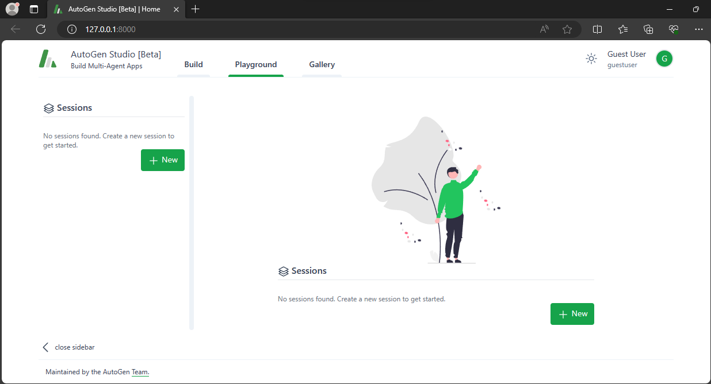
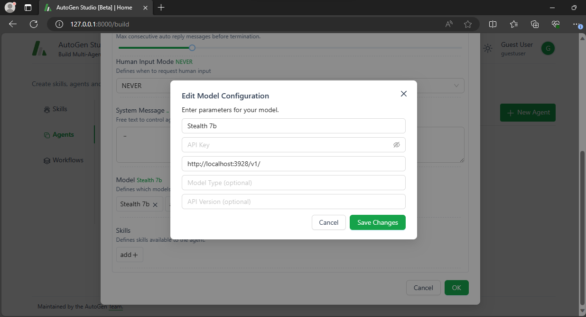
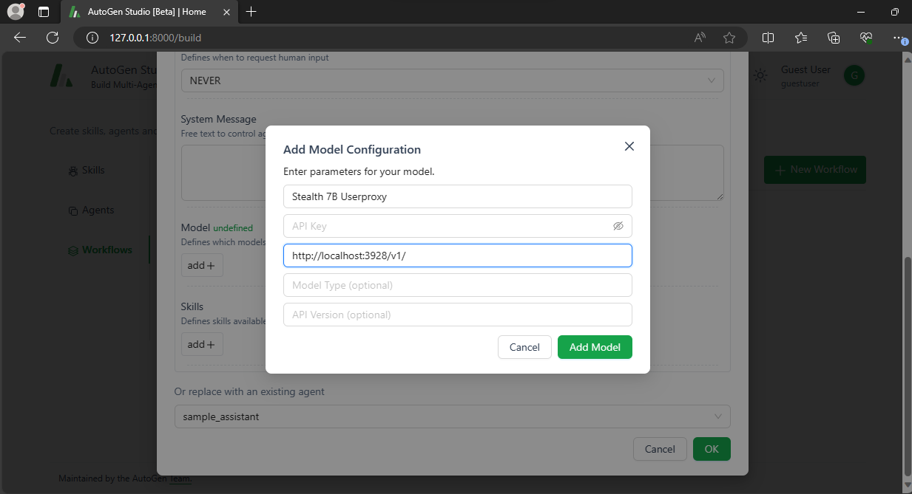
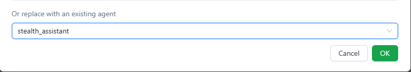

This guide demonstrates how to use Nitro with Autogen to develope a multi-agent framework.

## What is AutoGen?

AutoGen makes developing multi-agent conversations a breeze. It's perfect for complex Language Model (LLM) projects, offering flexible, interactive agents. These agents can work with LLMs, human input, and other tools in various combinations.

AutoGen Studio upgrades AutoGen with a user-friendly drag-and-drop interface. It simplifies creating and tweaking agents and workflows. You can start chat sessions, track chat history and files, and monitor time spent. It also lets users add extra skills to agents and share their projects easily, catering to all user levels.

## Setting Up

### Install AutoGen Studio

Just run:

```bash
pip install autogenstudio
```

### Launch AutoGen Studio
Use this command:

```bash
autogenstudio ui --port 8000
```

For more on AutoGen, visit their [page](https://microsoft.github.io/autogen/blog/2023/12/01/AutoGenStudio/).



## Using a Local Model with Nitro

**1. Start Nitro Server**

Open your terminal and run:
```bash
nitro
```
**2. Download Model**

To get the [Stealth 7B](https://huggingface.co/janhq/stealth-v1.3-GGUF) model, enter:

```bash title="Get a model"
mkdir model && cd model
wget -O stealth-7b-model.gguf https://huggingface.co/janhq/stealth-v1.3-GGUF/resolve/main/stealth-v1.3.Q4_K_M.gguf
```

> Explore more models at [The Bloke](https://huggingface.co/TheBloke).

**3. Load the Model**

Run this to load the model:

```bash title="Load model to the server"
curl http://localhost:3928/inferences/llamacpp/loadmodel \
  -H 'Content-Type: application/json' \
  -d '{
    "llama_model_path": "model/stealth-7b-model.gguf",
    "ctx_len": 512,
    "ngl": 100,
  }'
```

## Setting Up a Local Agent

In AutoGen Studio, go to the `Agent`` tab and set up a new agent.

**Key setting:** In `Model` section, use `Base URL`: http://localhost:3928/v1.



## Crafting a Workflow

Create a new workflow in `Workflows` tab

Navigate to the `Workflows` tab to create a new workflow. Change the `Sender` model to your Stealth model.



Make sure the `Receiver` uses the agent you just set up.



## Set a dummy OpenAI API Key

Set a dummy enviroment variable for OpenAI

```bash
export OPENAI_API_KEY=sk-***
```

You're all set! Test your agent in the `Playground`.