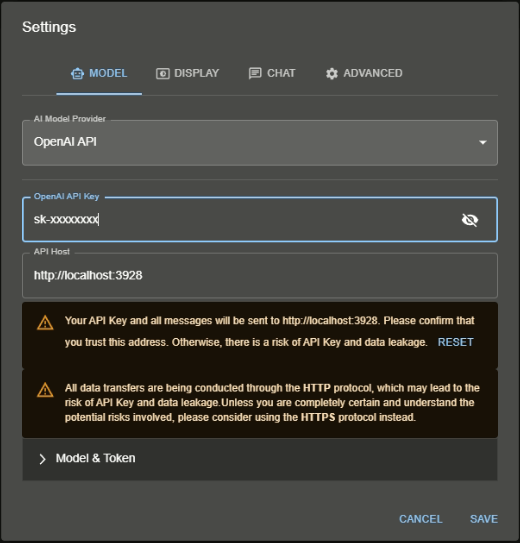

This guide demonstrates how to integrate Nitro with Chatbox, showcasing the compatibility of Nitro with various platforms.

## What is Chatbox?
Chatbox is a versatile desktop client that supports multiple cutting-edge Large Language Models (LLMs). It is available for Windows, Mac, and Linux operating systems. 

For more information, please visit the [Chatbox official GitHub page](https://github.com/Bin-Huang/chatbox).


## Downloading and Installing Chatbox

To download and install Chatbox, follow the instructions available at this [link](https://github.com/Bin-Huang/chatbox#download).

## Using Nitro as a Backend

1. Start Nitro server

Open your command line tool and enter:
```
nitro
```

2. Download Model

Use these commands to download and save the [Llama2 7B chat model](https://huggingface.co/TheBloke/Llama-2-7B-Chat-GGUF/tree/main):

```bash
mkdir model && cd model
wget -O llama-2-7b-model.gguf https://huggingface.co/TheBloke/Llama-2-7B-Chat-GGUF/resolve/main/llama-2-7b-chat.Q5_K_M.gguf?download=true
```

> For more GGUF model, please look at [The Bloke](https://huggingface.co/TheBloke).

3. Run the Model

To load the model, use the following command:

```
curl http://localhost:3928/inferences/llamacpp/loadmodel \
  -H 'Content-Type: application/json' \
  -d '{
    "llama_model_path": "model/llama-2-7b-chat.Q5_K_M.gguf",
    "ctx_len": 512,
    "ngl": 100,
  }'
```

4. Config chatbox
Adjust the `settings` in Chatbox to connect with Nitro. Change your settings to match the configuration shown in the image below:



5. Chat with the Model

Once the setup is complete, you can start chatting with the model using Chatbox. All functions of Chatbox are now enabled with Nitro as the backend.