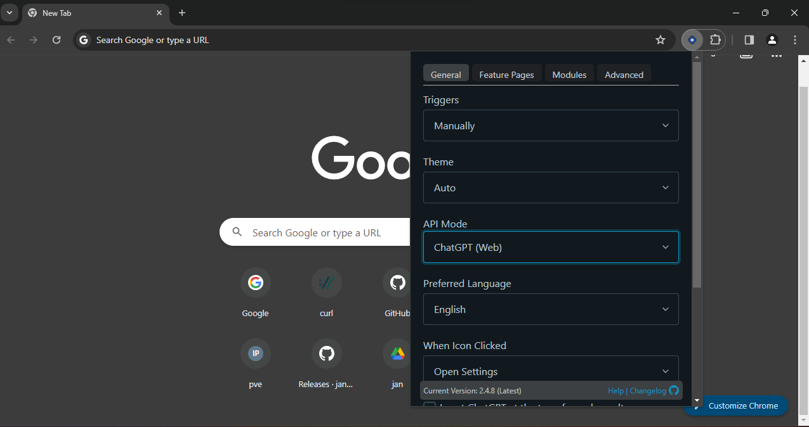
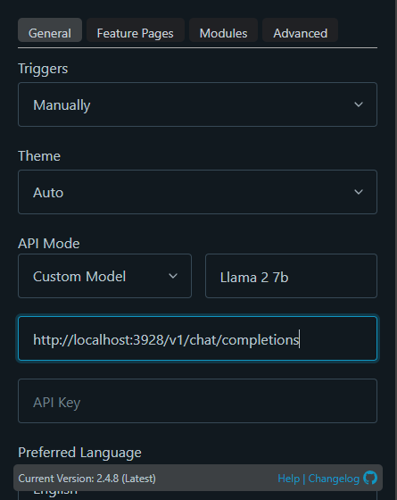
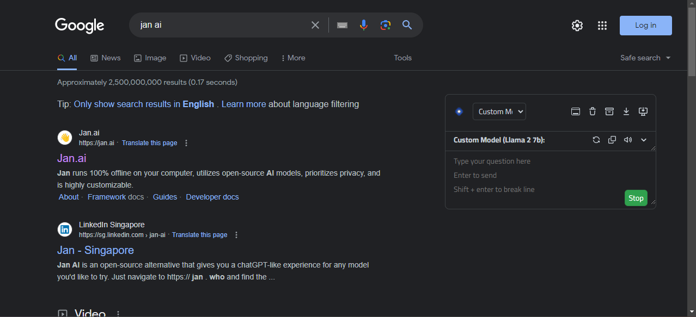

This guide demonstrates how to use Nitro on Web browser like an copilot on Web browser.

## Installation
We'll use [chatGPTBox](https://github.com/josStorer/chatGPTBox) for this setup.

- For Chrome/Edge, download directly from the [Google Web Store](https://chromewebstore.google.com/detail/chatgptbox/eobbhoofkanlmddnplfhnmkfbnlhpbbo).
- For other browsers, refer to their [installation guide](https://github.com/josStorer/chatGPTBox/wiki/Install).

## Using chatGPTBox with Nitro

**1. Start Nitro server**

Open your terminal and run:

```bash title="Run Nitro"
nitro
```

**2. Download Model**

Download the [Stealth 7B](https://huggingface.co/jan-hq/stealth-v1.3) model with these commands:

```bash title="Get a model"
mkdir model && cd model
wget -O stealth-7b.gguf https://huggingface.co/janhq/stealth-v1.3-GGUF/resolve/main/stealth-v1.3.Q4_K_M.gguf
```

> Explore more GGUF models at [The Bloke](https://huggingface.co/TheBloke).

**3. Run the Model**

To load the model, use the following command:

```bash title="Load model to the server"
curl http://localhost:3928/inferences/llamacpp/loadmodel \
  -H 'Content-Type: application/json' \
  -d '{
    "llama_model_path": "model/stealth-7b.gguf",
    "ctx_len": 512,
    "ngl": 100,
  }'
```

**4. Configure chatGPTBox**

Click the `chatGPTBox` icon in your browser to open the main menu.



In the `API Mode` section, switch to `Custom Model`.

Change the name to `Stealth 7B` and set the host to `http://localhost:3928/v1/chat/completions`



Your browser is now equipped with a copilot to help you on daily basis.



For detailed guidance, visit the [chatGPTBox guide](https://github.com/josStorer/chatGPTBox/wiki/Guide)

### Shortcut

| Shortcut | Description                                 |
|----------|---------------------------------------------|
| Ctrl+B       | Activate chat dialog box on any page. |
| Alt+B      | Summarize any page via the right-click menu. |
| Ctrl+Shift+H      | Open an independent conversation page. |

## Futher Usage

For convenient usage, you can utilize [Jan](https://jan.ai/), as it is integrated with Nitro.