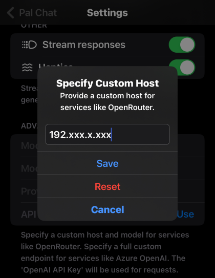

This guide demonstrates how to use Nitro with Pal Chat, enabling local AI chat capabilities on mobile devices.

## What is Pal - AI Chat Client?

Pal is a mobile app available on the App Store. It offers a customizable chat playground and supports various AI models including GPT-4 Turbo, GPT-4 Vision, DALL-E 3, Claude 2, PaLM, Openrouter, and locally hosted LLMs.

- [Download Pal Chat](https://apps.apple.com/us/app/pal-ai-chat-client/id6447545085)

## Using Pal with Nitro

**1. Start Nitro server**

Open your terminal:
```
nitro
```

**2. Download Model**

Use these commands to download and save the [Llama2 7B chat model](https://huggingface.co/TheBloke/Llama-2-7B-Chat-GGUF/tree/main):

```bash
mkdir model && cd model
wget -O llama-2-7b-model.gguf https://huggingface.co/TheBloke/Llama-2-7B-Chat-GGUF/resolve/main/llama-2-7b-chat.Q5_K_M.gguf?download=true
```

> For more GGUF model, please look at [The Bloke](https://huggingface.co/TheBloke).

**3. Run the Model**

To load the model, use the following command:

```
curl http://localhost:3928/inferences/llamacpp/loadmodel \
  -H 'Content-Type: application/json' \
  -d '{
    "llama_model_path": "model/llama-2-7b-chat.Q5_K_M.gguf",
    "ctx_len": 512,
    "ngl": 100,
  }'
```

**4. Config Pal Chat**

Adjust the `provide custom host` setting under `advanced settings` in Pal Chat to connect with Nitro. Enter your LAN IPv4 address (It should be something like 192.xxx.x.xxx).

> For instruction read: [How to find your IP](https://support.microsoft.com/en-us/windows/find-your-ip-address-in-windows-f21a9bbc-c582-55cd-35e0-73431160a1b9)



**5. Chat with the Model**

Once the setup is complete, you can start chatting with the model using Pal Chat.

<iframe width="380" height="675" src="https://www.youtube.com/embed/pq9_f0p39Fg" frameborder="0" allow="accelerometer; autoplay; encrypted-media; gyroscope; picture-in-picture" allowfullscreen></iframe>

## Futher Usage

For convenient usage, you can utilize [Jan](https://jan.ai/), as it is integrated with Nitro.